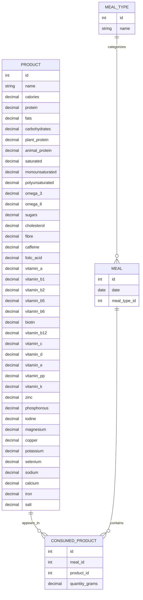
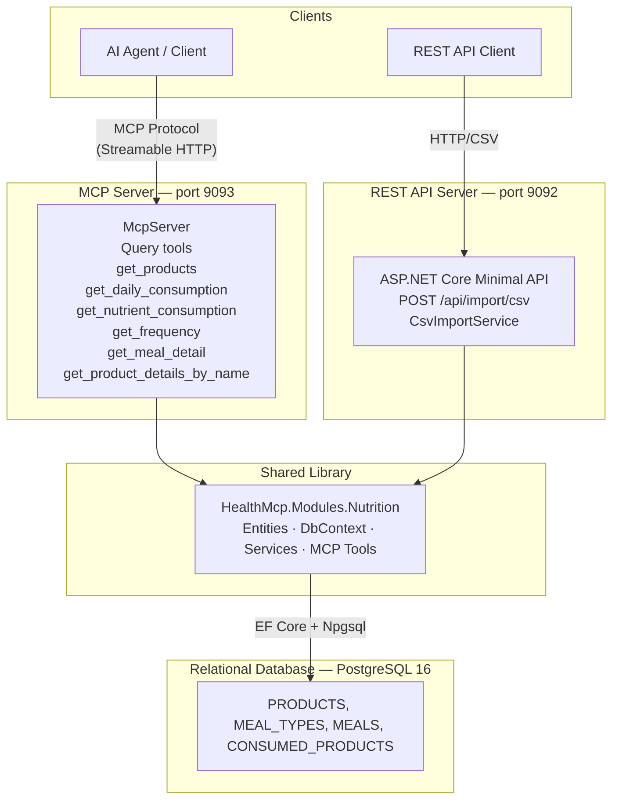

# Health MCP — Nutrition Module

A Model Context Protocol (MCP) server designed to maintain a comprehensive nutrition registry and provide powerful query capabilities for AI agents. This server enables structured storage and retrieval of nutritional data imported from CSV files.

## Overview

The Health MCP Nutrition Module acts as a centralized data hub for nutrition tracking, allowing AI agents to query product databases, analyze daily consumption, track nutrient intake, and provide intelligent insights based on structured food data. The system combines a REST API for data ingestion with MCP tools for programmatic access.

## Features

### REST API

- **CSV Import**: Import nutrition data from CSV files with per-100g normalization
- Standardized data ingestion pipeline that normalizes and deduplicates nutritional records
- Products identified by unique `(Name, Calories)` combination for smart skip/update logic

### MCP Tools for AI Agents

The server exposes the following query tools to enable AI agents to interact with nutrition data:

| Tool | Title | Description |
|------|-------|-------------|
| `get_products` | Get Products | List all products with energy, protein, fats, and carbohydrates per 100g. Use this when the user asks about available products or wants a quick overview of nutritional profiles. |
| `get_product_details_by_name` | Get Product Details by Name | Retrieve complete nutritional details for a product by exact name. Use this when the user asks about vitamins, minerals, or full breakdown of a specific food. |
| `get_daily_consumption` | Get Daily Consumption by Date Range | Returns aggregated daily totals for energy, protein, fats, and carbohydrates within a date range. Use this when the user asks "what did I eat" or wants daily macro summaries. |
| `get_nutrient_consumption` | Get Nutrient Consumption by Date Range | Returns consumption of a specific nutrient within a date range. Supports `aggregated` (total per day) or `detailed` (grouped by product) modes. Use this when the user asks about a specific nutrient like saturated fat, sodium, or vitamin C. |
| `get_frequency` | Get Frequency Within Date Range by Products | Returns how many times each product was consumed within a date range. Use this when the user asks "how often do I eat" a particular food. |
| `get_meal_detail` | Get Meal Detail by Date | Returns full meal breakdown including all products and their nutritional values for a specific date. Use this when the user asks what they ate on a particular day. |

## Database Schema

The application uses a relational database schema designed to capture the hierarchical nature of nutrition tracking:



### Schema Description

| Table | Description |
|-------|-------------|
| **PRODUCT** | Master list of foods with nutritional values per 100g. Unique constraint on `(Name, Calories)` for duplicate detection. Supports 30+ optional nutrient fields (vitamins, minerals, fatty acids). |
| **MEAL_TYPE** | Categorization labels (e.g., Breakfast, Lunch, Dinner, Snack). Name column has a unique index. |
| **MEAL** | A meal session on a specific date. Unique constraint on `(Date, MealTypeId)` ensures at most one meal per type per day. |
| **CONSUMED_PRODUCT** | Junction table recording which product was consumed in which meal and in what quantity (grams). Unique constraint on `(MealId, ProductId, QuantityGrams)` prevents identical duplicate rows. |

## Architecture



## Requirements

- .NET 10 SDK
- Docker (for PostgreSQL 16)

## Installation

1. Clone the repository:

```bash
git clone <repo-url>
cd health-mcp
```

2. Start PostgreSQL using Docker Compose:

```bash
docker compose up -d
```

This starts a PostgreSQL 16 container with:
- Database: `health_mcp`
- User: `postgres`
- Password: `postgres`
- Port: `5432`

3. Apply database migrations:

```bash
dotnet ef database update --project src/HealthMcp.Modules.Nutrition --startup-project src/HealthMcp.Api
```

## Usage

### Starting the Server

```bash
# REST API (port 9092)
dotnet run --project src/HealthMcp.Api

# MCP Server (port 9093)
dotnet run --project src/HealthMcp.McpServer
```

### Importing Nutrition CSV Data

Export your nutrition data and use the REST API endpoint to import:

```bash
curl -X POST http://localhost:9092/api/import/csv \
  -H "Content-Type: text/csv" \
  --data-binary @nutrition_data.csv
```

#### CSV Format

The expected CSV format matches common nutrition tracking exports:

```
Date,Meal,"Products and dishes","quantity (g)","calories (kcal)","Protein (g)","Fats (g)","Carbohydrates (g)"
2026-02-01,Breakfast,"Feta cheese",6,16.56,0.99,1.38,0.042
2026-02-01,Breakfast,"Eggs",60,83.4,7.5,5.82,0.36
```

CSV values are per consumed quantity — the import service normalizes to per 100g for the product database. Optional columns for detailed nutrients (vitamins, minerals, fatty acids) are supported.

### MCP Client Configuration

#### Claude Desktop

Add to `~/Library/Application Support/Claude/claude_desktop_config.json`:

```json
{
  "mcpServers": {
    "health-nutrition": {
      "url": "http://localhost:9093"
    }
  }
}
```

#### Generic MCP Client

Any MCP-compatible client can connect to `http://localhost:9093` using streamable HTTP transport.

### Example Queries

Once connected via MCP, you can ask questions like:

| Natural Language Query | MCP Tool Called |
|------------------------|-----------------|
| "Show me all products in my database" | `get_products` |
| "What's the full nutritional breakdown of feta cheese?" | `get_product_details_by_name("Feta cheese")` |
| "How many calories did I eat on February 1st?" | `get_daily_consumption("2026-02-01", "2026-02-01")` |
| "How much saturated fat have I had this week?" | `get_nutrient_consumption("2026-02-01", "2026-02-07", "saturated", "aggregated")` |
| "What foods do I eat most often?" | `get_frequency("2026-01-01", "2026-02-01")` |
| "What did I eat for breakfast on February 1st?" | `get_meal_detail("2026-02-01")` |

#### Tool Details

| Tool | Parameters | Returns |
|------|-----------|---------|
| `get_products` | none | List of `{name, energy, protein, fats, carbs}` |
| `get_product_details_by_name` | `productName: string` | Full `Product` object or null |
| `get_daily_consumption` | `startDate: string`, `endDate: string` (ISO date) | List of `{date, calories, protein, fats, carbs}` |
| `get_nutrient_consumption` | `startDate`, `endDate`, `nutrient`, `mode` ("aggregated" \| "detailed") | List of `{date, value, products?}` |
| `get_frequency` | `startDate: string`, `endDate: string` | List of `{name, count}` sorted by frequency |
| `get_meal_detail` | `date: string` | List of `{mealType, products: [{name, quantityGrams, calories}]}` |

### Query Capabilities

The MCP tools enable rich querying scenarios such as:

- **Product Lookup**: "What's the protein content of eggs per 100g?"
- **Daily Intake**: "How many calories did I consume yesterday?"
- **Nutrient Tracking**: "Track my sodium intake over the past week"
- **Meal Analysis**: "What did I eat for lunch on Tuesday?"
- **Frequency Analysis**: "Which foods appear most often in my diet?"
- **Detailed Breakdown**: "Show me the full vitamin profile of feta cheese"

## Environment Variables

All configuration is managed via `appsettings.json`.

| Variable / Setting | Default | Description |
|--------------------|---------|-------------|
| `ConnectionStrings:Default` | `Host=localhost;Database=health_mcp;Username=postgres;Password=postgres` | PostgreSQL connection string |
| `Kestrel:Endpoints:Http:Url` (API) | `http://localhost:9092` | Port for the REST API |
| `Kestrel:Endpoints:Http:Url` (MCP) | `http://localhost:9093` | Port for the MCP server |

## Project Structure

```
health-mcp/
├── src/
│   ├── HealthMcp.Modules.Nutrition/          # Shared library
│   │   ├── Entities/                         # Domain models
│   │   │   ├── Product.cs
│   │   │   ├── MealType.cs
│   │   │   ├── Meal.cs
│   │   │   └── ConsumedProduct.cs
│   │   ├── Infrastructure/
│   │   │   ├── Configurations/              # EF Core entity configurations
│   │   │   │   ├── ProductConfiguration.cs
│   │   │   │   ├── MealTypeConfiguration.cs
│   │   │   │   ├── MealConfiguration.cs
│   │   │   │   └── ConsumedProductConfiguration.cs
│   │   │   └── NutritionDbContext.cs
│   │   ├── Services/
│   │   │   ├── CsvImportService.cs
│   │   │   └── ImportResult.cs
│   │   ├── McpTools/                        # MCP tool implementations
│   │   │   ├── GetProductsTool.cs
│   │   │   ├── GetProductDetailsByNameTool.cs
│   │   │   ├── GetDailyConsumptionByDateRangeTool.cs
│   │   │   ├── GetNutrientConsumptionByDateRangeTool.cs
│   │   │   ├── GetMealDetailByDateTool.cs
│   │   │   └── GetFrequencyWithinDateRangeByProductsTool.cs
│   │   └── Migrations/                      # EF Core migrations
│   ├── HealthMcp.Api/                       # REST API
│   │   ├── Endpoints/
│   │   │   └── CsvImportEndpoints.cs
│   │   ├── Program.cs
│   │   └── appsettings.json
│   └── HealthMcp.McpServer/                 # MCP Server
│       ├── Program.cs
│       └── appsettings.json
├── tests/
│   ├── HealthMcp.Modules.Nutrition.Tests/   # Unit tests
│   │   ├── Services/
│   │   │   └── CsvImportServiceTests.cs
│   │   └── McpTools/
│   │       ├── GetProductsToolTests.cs
│   │       ├── GetProductDetailsByNameToolTests.cs
│   │       ├── GetDailyConsumptionByDateRangeToolTests.cs
│   │       ├── GetNutrientConsumptionByDateRangeToolTests.cs
│   │       ├── GetMealDetailByDateToolTests.cs
│   │       └── GetFrequencyWithinDateRangeByProductsToolTests.cs
│   └── HealthMcp.Api.Tests/                 # Integration tests
│       ├── HealthMcpApiFactory.cs
│       └── CsvImportEndpointTests.cs
├── docker-compose.yml                       # PostgreSQL container
├── AGENTS.md                                # Agentic worker guide
├── README.md                                # This file
└── HealthMcp.slnx                           # Solution file (.slnx format)
```

## Data Flow

1. **Import**: CSV data is parsed and normalized by `CsvImportService` — values per consumed quantity are scaled to per 100g for the product database
2. **Storage**: Data is persisted in the relational schema (Product → Meal → ConsumedProduct) via EF Core
3. **Query**: MCP tools provide filtered access to nutrition history
4. **Analysis**: AI agents can calculate daily totals, nutrient breakdowns, and consumption patterns

## Development

### Running Tests

```bash
# Run all tests
dotnet test

# Run specific test class
dotnet test --filter "FullyQualifiedName~CsvImportServiceTests"
```

### Adding a Migration

```bash
dotnet ef migrations add <MigrationName> \
  --project src/HealthMcp.Modules.Nutrition \
  --startup-project src/HealthMcp.Api
```

### NuGet Dependencies

| Package | Purpose |
|---------|---------|
| `Microsoft.EntityFrameworkCore` | ORM framework |
| `Npgsql.EntityFrameworkCore.PostgreSQL` | PostgreSQL provider |
| `ModelContextProtocol` | MCP SDK for tool definitions |
| `ModelContextProtocol.AspNetCore` | MCP over HTTP (Streamable HTTP) |
| `CsvHelper` | CSV parsing |
| `Moq` | Mocking for unit tests |
| `Microsoft.EntityFrameworkCore.InMemory` | In-memory database for tests |
| `Microsoft.AspNetCore.Mvc.Testing` | Integration test host |
